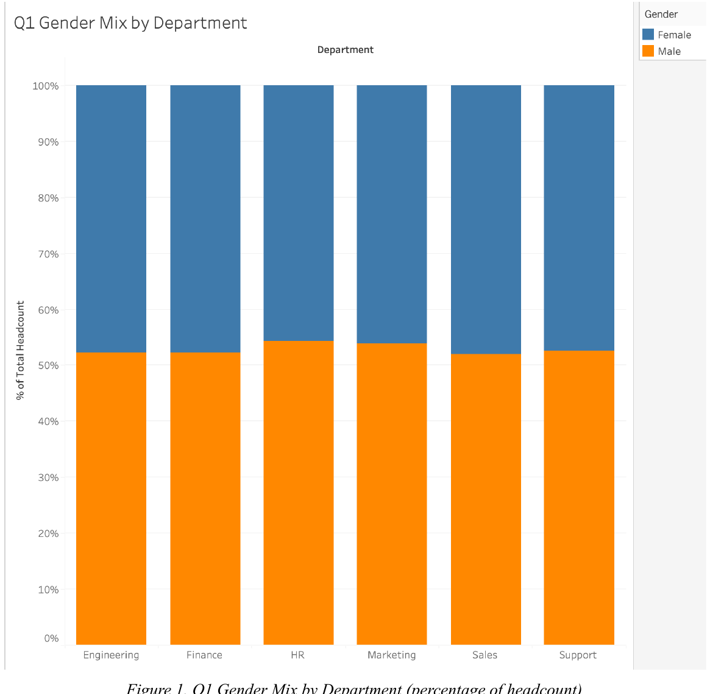
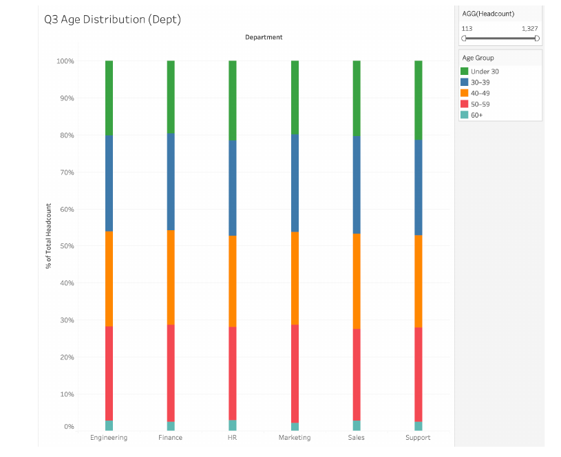
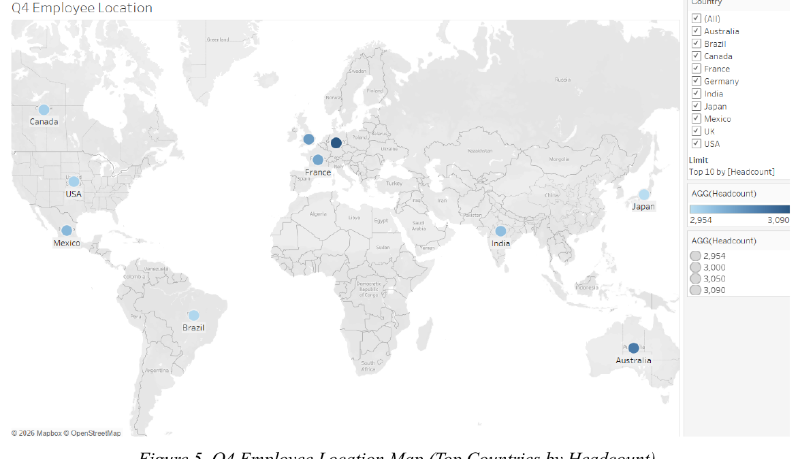

# HR Workforce Demographics & Representation Dashboard

## Project Overview
This Tableau workforce analytics project examines demographic representation, leadership composition, age distribution, and geographic employee concentration using a dataset of **30,000 employee records**.

The dashboard was designed to support practical HR and workforce planning questions, including:
- Where gender gaps appear across departments
- Whether representation differs across executive, manager, and non-leadership roles
- How employee age patterns vary across departments
- Where employee headcount is geographically concentrated

This was completed as a **team project for INFO584 Data Visualization**.

## Tools Used
- Tableau
- Data Visualization
- Workforce Analytics
- Descriptive Analytics
- Calculated Fields
- Geographic Mapping
- Dashboard Storytelling

## Key Dashboard Features
- Gender composition by department using percent-of-total comparisons
- Gender representation by leadership level
- Age distribution analysis across departments and roles
- Geographic employee concentration map using headcount by country
- Tableau calculated fields for headcount, role level, and age groups
- Filters and dashboard-ready visual structure for stakeholder exploration

## Key Findings
- The dataset included **30,000 employee records**
- Overall gender composition was **47.2% female** and **52.8% male**
- Employee ages ranged from **22 to 60**, with a median age of **41**
- The workforce was distributed across **10 countries**
- **Germany** had the largest employee concentration, with **3,090 employees**, representing **10.3%** of the dataset
- Gender representation was relatively balanced across departments and leadership levels, with slight male overrepresentation across categories

## Files Included
- `Final Project Aadil.twbx` – Tableau workbook/dashboard file
- `INFO584 Group 1 Final Project.pdf` – Full project report, analysis, findings, and methodology

## My Contribution
As a member of the project team, I contributed to the workforce analytics process through dashboard-focused analysis, interpretation of HR representation patterns, and development of clear, decision-oriented visual storytelling for the final project.

## Interactive Dashboard
A published Tableau dashboard link is included in the full project report PDF.

## Dashboard Visuals

### Gender Mix by Department

### Age Distribution by Department

### Employee Location Map

